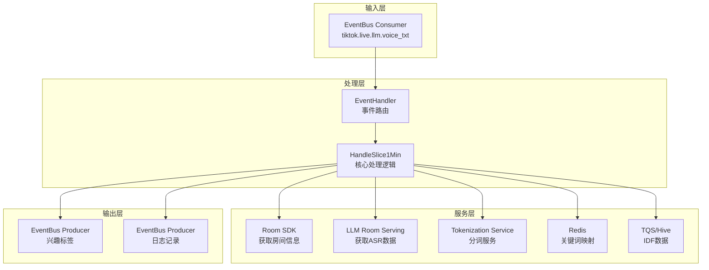
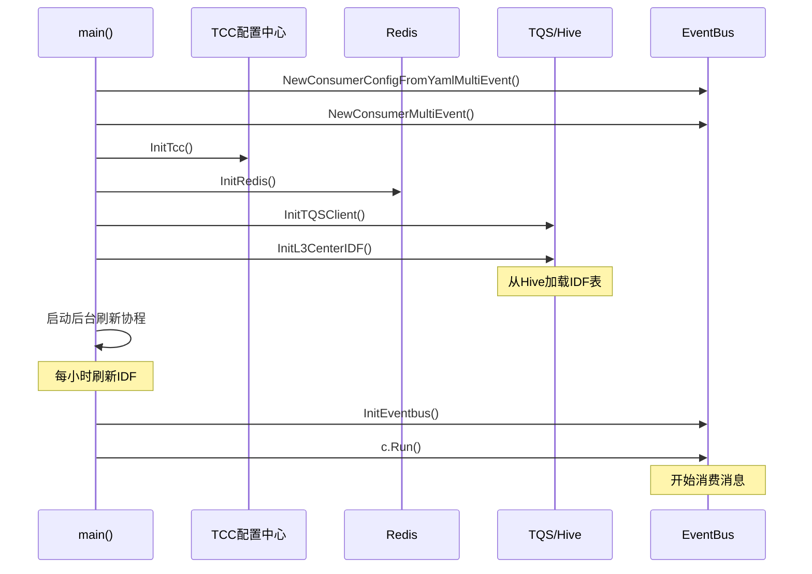
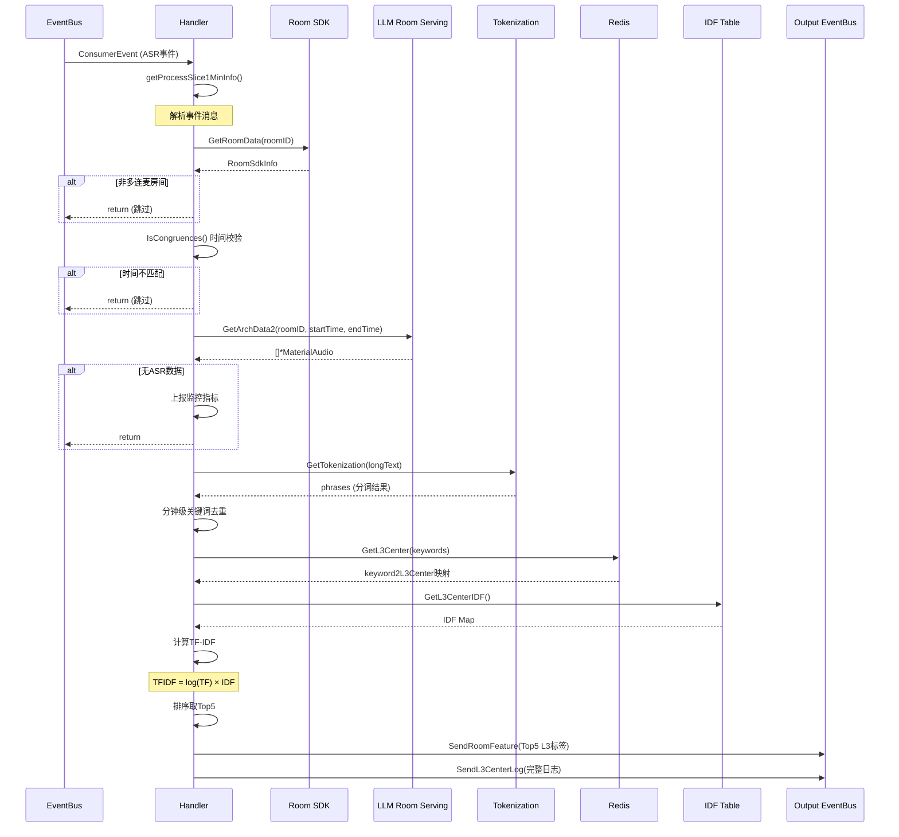
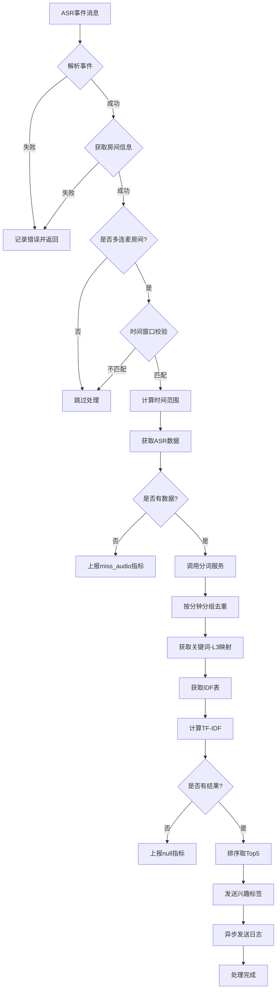
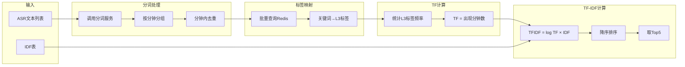
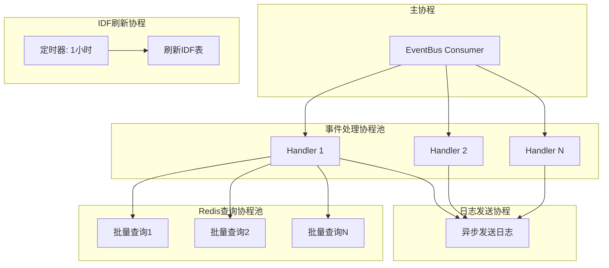
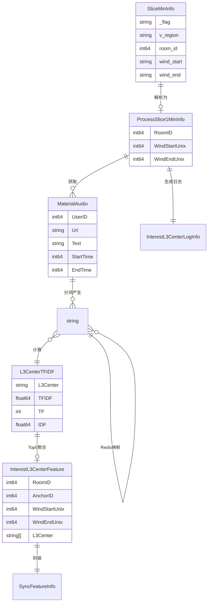
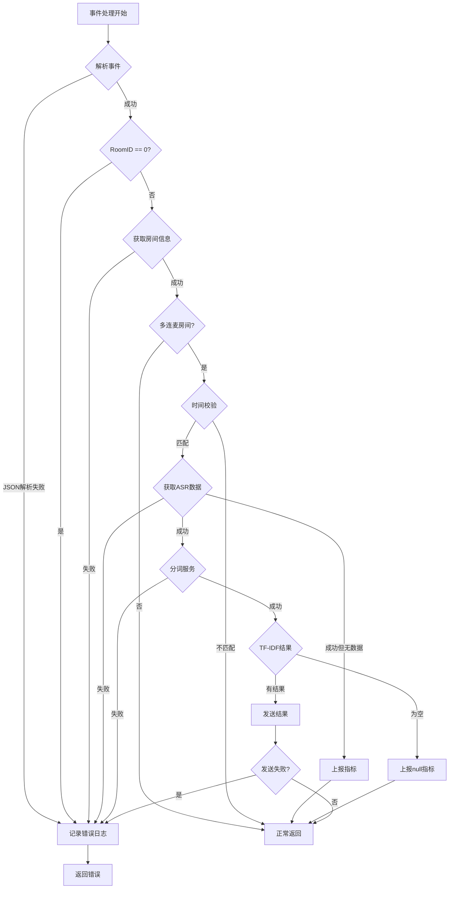
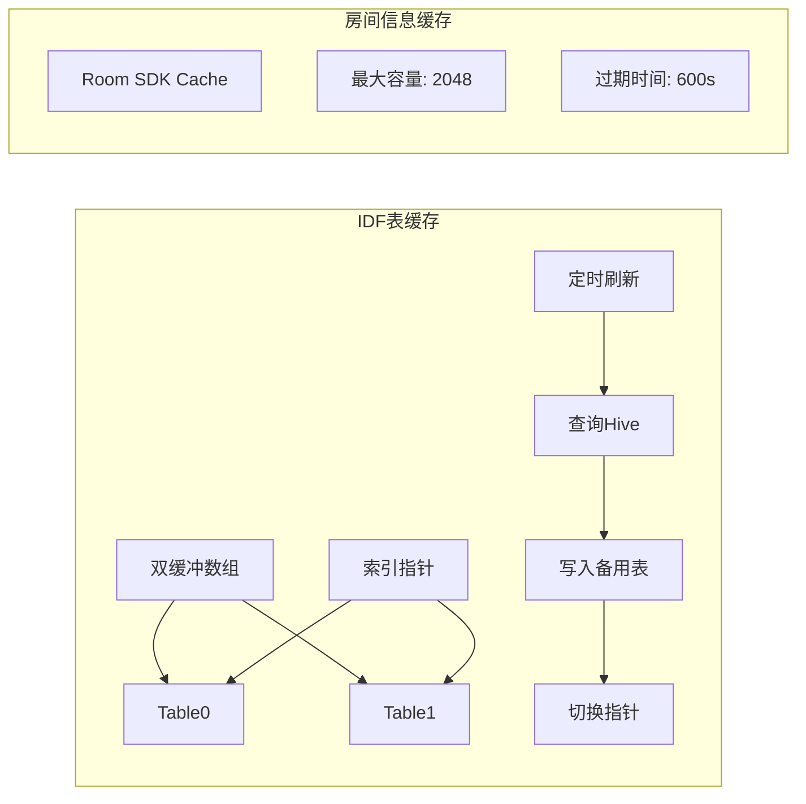
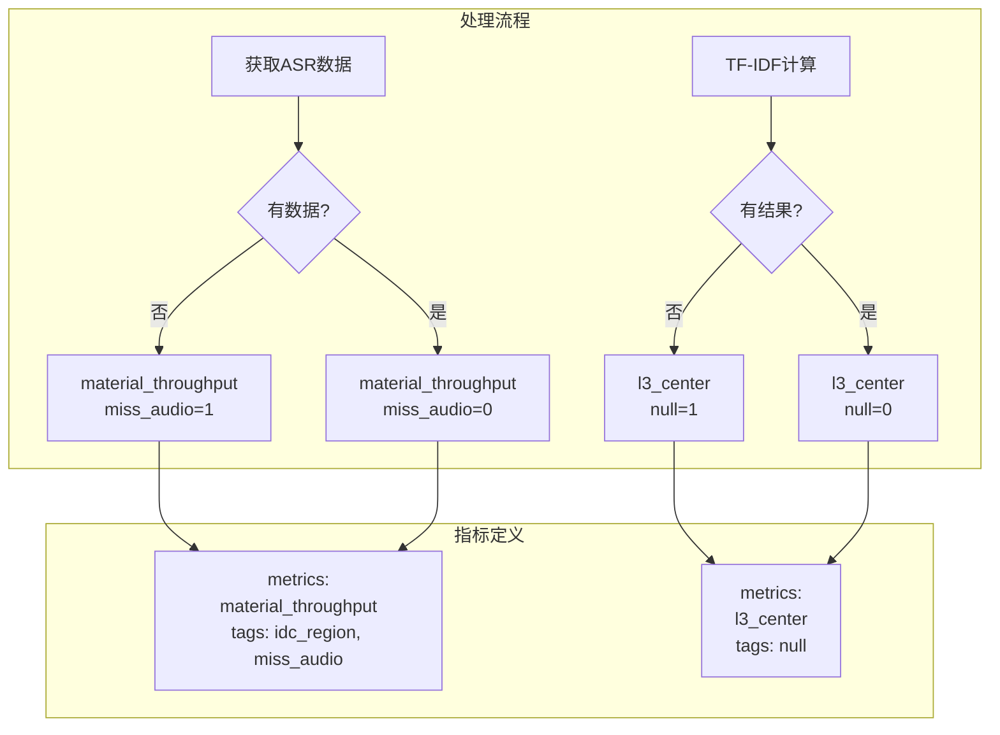

# 代码逻辑图与数据流图

## 1. 整体架构图

```mermaid
graph TB
    subgraph 输入层
        A[EventBus Consumer<br/>tiktok.live.llm.voice_txt]
    end

    subgraph 处理层
        B[EventHandler<br/>事件路由]
        C[HandleSlice1Min<br/>核心处理逻辑]
    end

    subgraph 服务层
        D[Room SDK<br/>获取房间信息]
        E[LLM Room Serving<br/>获取ASR数据]
        F[Tokenization Service<br/>分词服务]
        G[Redis<br/>关键词映射]
        H[TQS/Hive<br/>IDF数据]
    end

    subgraph 输出层
        I[EventBus Producer<br/>兴趣标签]
        J[EventBus Producer<br/>日志记录]
    end

    A --> B
    B --> C
    C --> D
    C --> E
    C --> F
    C --> G
    C --> H
    C --> I
    C --> J
```

## 2. 服务启动流程

```mermaid
sequenceDiagram
    participant Main as main()
    participant TCC as TCC配置中心
    participant Redis as Redis
    participant TQS as TQS/Hive
    participant EventBus as EventBus

    Main->>EventBus: NewConsumerConfigFromYamlMultiEvent()
    Main->>EventBus: NewConsumerMultiEvent()
    Main->>TCC: InitTcc()
    Main->>Redis: InitRedis()
    Main->>TQS: InitTQSClient()
    Main->>TQS: InitL3CenterIDF()
    Note over TQS: 从Hive加载IDF表
    Main->>Main: 启动后台刷新协程
    Note over Main: 每小时刷新IDF
    Main->>EventBus: InitEventbus()
    Main->>EventBus: c.Run()
    Note over EventBus: 开始消费消息
```

## 3. 事件处理时序图

```mermaid
sequenceDiagram
    participant EB as EventBus
    participant H as Handler
    participant Room as Room SDK
    participant ASR as LLM Room Serving
    participant Tok as Tokenization
    participant Redis as Redis
    participant IDF as IDF Table
    participant Out as Output EventBus

    EB->>H: ConsumerEvent (ASR事件)
    H->>H: getProcessSlice1MinInfo()
    Note over H: 解析事件消息

    H->>Room: GetRoomData(roomID)
    Room-->>H: RoomSdkInfo

    alt 非多连麦房间
        H-->>EB: return (跳过)
    end

    H->>H: IsCongruences() 时间校验

    alt 时间不匹配
        H-->>EB: return (跳过)
    end

    H->>ASR: GetArchData2(roomID, startTime, endTime)
    ASR-->>H: []*MaterialAudio

    alt 无ASR数据
        H->>H: 上报监控指标
        H-->>EB: return
    end

    H->>Tok: GetTokenization(longText)
    Tok-->>H: phrases (分词结果)

    H->>H: 分钟级关键词去重

    H->>Redis: GetL3Center(keywords)
    Redis-->>H: keyword2L3Center映射

    H->>IDF: GetL3CenterIDF()
    IDF-->>H: IDF Map

    H->>H: 计算TF-IDF
    Note over H: TFIDF = log(TF) × IDF

    H->>H: 排序取Top5

    H->>Out: SendRoomFeature(Top5 L3标签)
    H->>Out: SendL3CenterLog(完整日志)
```

## 4. 数据处理流程图

```mermaid
flowchart TD
    A[ASR事件消息] --> B{解析事件}
    B -->|失败| C[记录错误并返回]
    B -->|成功| D{获取房间信息}

    D -->|失败| C
    D -->|成功| E{是否多连麦房间?}

    E -->|否| F[跳过处理]
    E -->|是| G{时间窗口校验}

    G -->|不匹配| F
    G -->|匹配| H[计算时间范围]

    H --> I[获取ASR数据]
    I --> J{是否有数据?}

    J -->|否| K[上报miss_audio指标]
    J -->|是| L[调用分词服务]

    L --> M[按分钟分组去重]
    M --> N[获取关键词-L3映射]
    N --> O[获取IDF表]

    O --> P[计算TF-IDF]
    P --> Q{是否有结果?}

    Q -->|否| R[上报null指标]
    Q -->|是| S[排序取Top5]

    S --> T[发送兴趣标签]
    T --> U[异步发送日志]
    U --> V[处理完成]
```

## 5. TF-IDF计算流程

```mermaid
flowchart LR
    subgraph 输入
        A[ASR文本列表]
        B[IDF表]
    end

    subgraph 分词处理
        C[调用分词服务]
        D[按分钟分组]
        E[分钟内去重]
    end

    subgraph 标签映射
        F[批量查询Redis]
        G[关键词→L3标签]
    end

    subgraph TF计算
        H[统计L3标签频率]
        I[TF = 出现分钟数]
    end

    subgraph TF-IDF计算
        J[TFIDF = log TF × IDF]
        K[降序排序]
        L[取Top5]
    end

    A --> C --> D --> E
    E --> F --> G
    G --> H --> I
    I --> J
    B --> J
    J --> K --> L
```

## 6. 并发处理模型

```mermaid
graph TB
    subgraph 主协程
        A[EventBus Consumer]
    end

    subgraph 事件处理协程池
        B[Handler 1]
        C[Handler 2]
        D[Handler N]
    end

    subgraph IDF刷新协程
        E[定时器: 1小时]
        F[刷新IDF表]
    end

    subgraph 日志发送协程
        G[异步发送日志]
    end

    subgraph Redis查询协程池
        H[批量查询1]
        I[批量查询2]
        J[批量查询N]
    end

    A --> B
    A --> C
    A --> D

    E --> F

    B --> G
    C --> G
    D --> G

    B --> H
    B --> I
    B --> J
```

## 7. 数据模型关系图

```mermaid
erDiagram
    SliceMinInfo ||--o| ProcessSlice1MinInfo : "解析为"
    ProcessSlice1MinInfo ||--o{ MaterialAudio : "获取"
    MaterialAudio ||--o{ string : "分词产生"
    string ||--o{ string : "Redis映射"
    string }o--|| L3CenterTFIDF : "计算"
    L3CenterTFIDF ||--o| InterestL3CenterFeature : "Top5聚合"
    InterestL3CenterFeature ||--|| SyncFeatureInfo : "封装"
    ProcessSlice1MinInfo ||--|| InterestL3CenterLogInfo : "生成日志"

    SliceMinInfo {
        string _flag
        string v_region
        int64 room_id
        string wind_start
        string wind_end
    }

    ProcessSlice1MinInfo {
        int64 RoomID
        int64 WindStartUnix
        int64 WindEndUnix
    }

    MaterialAudio {
        int64 UserID
        string Uri
        string Text
        int64 StartTime
        int64 EndTime
    }

    L3CenterTFIDF {
        string L3Center
        float64 TFIDF
        int TF
        float64 IDF
    }

    InterestL3CenterFeature {
        int64 RoomID
        int64 AnchorID
        int64 WindStartUnix
        int64 WindEndUnix
        string[] L3Center
    }
```

## 8. 错误处理流程

```mermaid
flowchart TD
    A[事件处理开始] --> B{解析事件}

    B -->|JSON解析失败| C[记录错误日志]
    C --> D[返回错误]

    B -->|成功| E{RoomID == 0?}
    E -->|是| C
    E -->|否| F{获取房间信息}

    F -->|失败| C
    F -->|成功| G{多连麦房间?}

    G -->|否| H[正常返回]
    G -->|是| I{时间校验}

    I -->|不匹配| H
    I -->|匹配| J{获取ASR数据}

    J -->|失败| C
    J -->|成功但无数据| K[上报指标]
    K --> H

    J -->|成功| L{分词服务}
    L -->|失败| C
    L -->|成功| M{TF-IDF结果}

    M -->|为空| N[上报null指标]
    N --> H
    M -->|有结果| O[发送结果]
    O --> P{发送失败?}

    P -->|是| C
    P -->|否| H
```

## 9. 缓存策略

```mermaid
graph LR
    subgraph IDF表缓存
        A[双缓冲数组] --> B[Table0]
        A --> C[Table1]
        D[索引指针] --> B
        D --> C

        E[定时刷新] --> F[查询Hive]
        F --> G[写入备用表]
        G --> H[切换指针]
    end

    subgraph 房间信息缓存
        I[Room SDK Cache]
        J[最大容量: 2048]
        K[过期时间: 600s]
    end
```

## 10. 监控埋点

```mermaid
graph TB
    subgraph 处理流程
        A[获取ASR数据] --> B{有数据?}
        B -->|否| C[material_throughput<br/>miss_audio=1]
        B -->|是| D[material_throughput<br/>miss_audio=0]

        E[TF-IDF计算] --> F{有结果?}
        F -->|否| G[l3_center<br/>null=1]
        F -->|是| H[l3_center<br/>null=0]
    end

    subgraph 指标定义
        C --> I["metrics:<br/>material_throughput<br/>tags: idc_region, miss_audio"]
        D --> I
        G --> J["metrics:<br/>l3_center<br/>tags: null"]
        H --> J
    end
```
