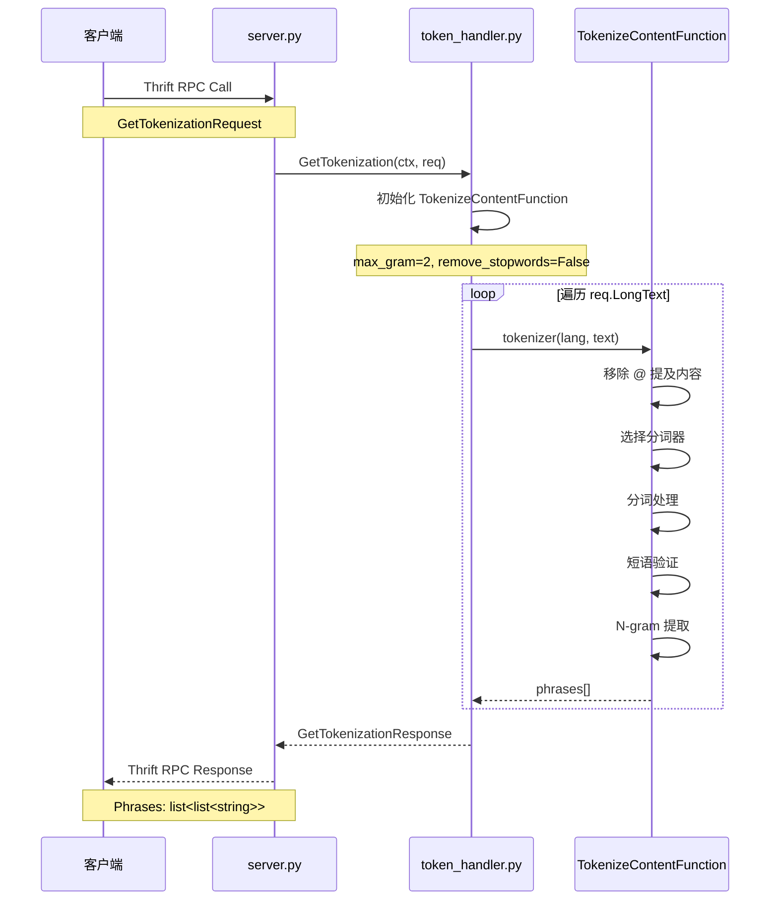
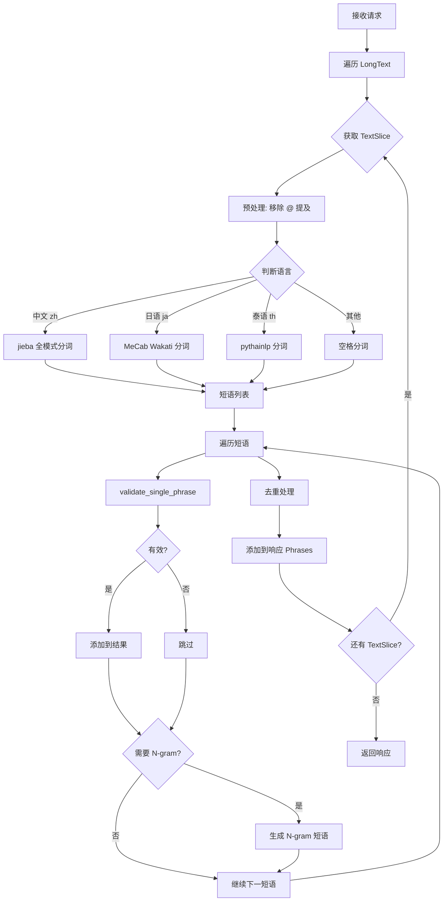
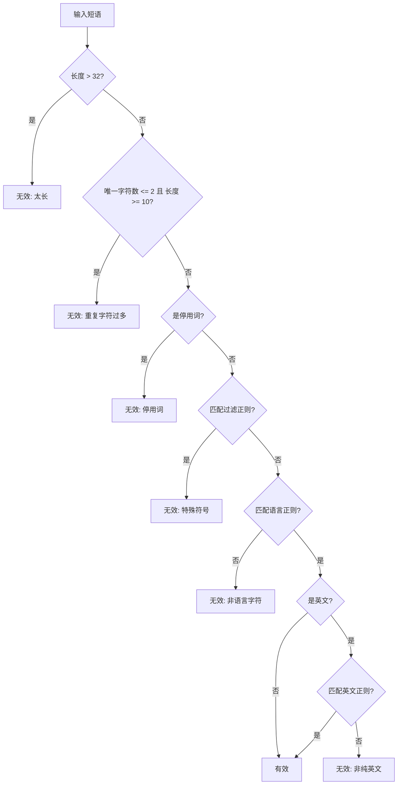

# Multi Guest Interest 项目文档

## 1. 项目目的

本项目是一个**多人直播兴趣热点 Python 服务**，主要提供**多语言文本分词与短语提取**功能。

### 核心功能
- 接收多语言文本内容，进行智能分词处理
- 支持中文、日语、泰语、英语、阿拉伯语、法语、德语、印尼语、意大利语、葡萄牙语、俄语、西班牙语、土耳其语等多种语言
- 提取有意义的短语和 N-gram 词组
- 为多人直播场景中的兴趣热点分析提供基础能力

---

## 2. 项目结构

```
multi_guest_interest/
├── server.py                 # 服务入口，Euler Thrift 服务
├── handler/
│   └── token_handler.py      # 核心业务逻辑：分词处理
├── utils/
│   └── log_utils.py          # 日志工具
├── idls/
│   ├── base.thrift           # 基础 Thrift 结构定义
│   └── webcast/linkmic/
│       └── multi_guest_interest.thrift  # 服务接口定义
├── resources/
│   └── nltk_data/            # NLTK 停用词数据
├── requirements.txt          # Python 依赖
└── tce_run.sh               # TCE 部署启动脚本
```

---

## 3. 代码链路

### 3.1 整体架构

```
┌─────────────────────────────────────────────────────────────────┐
│                        客户端调用方                               │
│                   (多人直播服务/推荐系统)                          │
└─────────────────────────┬───────────────────────────────────────┘
                          │ Thrift RPC
                          ▼
┌─────────────────────────────────────────────────────────────────┐
│                     server.py                                    │
│  ┌─────────────────────────────────────────────────────────┐    │
│  │  Euler Server (LinkMicService)                          │    │
│  │  - 监听 TCP 端口 (默认 8888)                              │    │
│  │  - 注册 GetTokenization 方法                             │    │
│  └────────────────────────┬────────────────────────────────┘    │
└───────────────────────────┼─────────────────────────────────────┘
                            │
                            ▼
┌─────────────────────────────────────────────────────────────────┐
│                 handler/token_handler.py                         │
│  ┌─────────────────────────────────────────────────────────┐    │
│  │  GetTokenization()                                       │    │
│  │  - 解析请求参数                                          │    │
│  │  - 初始化分词器                                          │    │
│  │  - 遍历文本切片进行分词                                   │    │
│  └────────────────────────┬────────────────────────────────┘    │
│                           │                                      │
│                           ▼                                      │
│  ┌─────────────────────────────────────────────────────────┐    │
│  │  TokenizeContentFunction                                 │    │
│  │  - 语言检测与分词器选择                                   │    │
│  │  - 短语验证与过滤                                        │    │
│  │  - N-gram 提取                                          │    │
│  └─────────────────────────────────────────────────────────┘    │
└─────────────────────────────────────────────────────────────────┘
```

### 3.2 调用链路图



---

## 4. 主要方法

### 4.1 服务入口 (server.py)

| 方法 | 说明 |
|------|------|
| `do_lipsum(ctx, req)` | Thrift 服务入口，注册为 `GetTokenization` 方法 |

### 4.2 核心业务 (handler/token_handler.py)

| 方法/类 | 说明 |
|---------|------|
| `GetTokenization(ctx, req)` | 主入口函数，处理分词请求 |
| `TokenizeContentFunction` | 分词核心类 |
| `TokenizeContentFunction.__call__(lang, content, dedup)` | 执行分词 |
| `TokenizeContentFunction.validate_single_phrase(lang, phrase)` | 验证短语有效性 |
| `TokenizeContentFunction.extract_all_phrases(lang, phrases)` | 提取所有有效短语（含 N-gram） |
| `add_tokenizer(lang, tokenizer_func)` | 动态添加分词器 |
| `get_scm_root_path()` | 获取项目根路径 |

### 4.3 工具类 (utils/log_utils.py)

| 方法 | 说明 |
|------|------|
| `log_info(msg, title, tojson, no_trunc)` | 记录 INFO 日志 |
| `log_err(msg, title, tojson)` | 记录 ERROR 日志 |
| `is_ppe()` | 判断是否为 PPE 环境 |
| `get_env()` | 获取当前环境 |

---

## 5. 实现方式

### 5.1 多语言分词器映射

```python
_tokenizer_func = {
    'ja': MeCab.Tagger("-Owakati"),      # 日语: MeCab
    'th': word_tokenize,                  # 泰语: pythainlp
    'zh': jieba.cut(cut_all=True)         # 中文: jieba 全模式
}
```

| 语言 | 分词库 | 分词方式 |
|------|--------|----------|
| 中文 (zh) | jieba | 全模式分词 |
| 日语 (ja) | MeCab | Wakati 模式 |
| 泰语 (th) | pythainlp | 默认分词 |
| 其他语言 | 内置 | 空格分词 |

### 5.2 停用词支持

使用 NLTK 内置停用词库，支持以下语言：
- 英语 (en)、阿拉伯语 (ar)、法语 (fr)、德语 (de)
- 印尼语 (id)、意大利语 (it)、葡萄牙语 (pt)
- 俄语 (ru)、西班牙语 (es)、土耳其语 (tr)

### 5.3 短语验证规则

`validate_single_phrase()` 方法过滤无效短语：

1. **长度限制**: 短语长度 <= 32
2. **重复字符**: 如果唯一字符数 <= 2 且长度 >= 10，过滤
3. **停用词过滤**: 可选，过滤常见停用词
4. **正则过滤**:
   - 过滤特殊符号开头或纯符号的内容 (`_phrase_filter_pattern`)
   - 过滤非语言字符 (`_lang_pattern`)
5. **英文验证**: 英文短语需匹配 ASCII 字符范围

### 5.4 N-gram 提取

`extract_all_phrases()` 实现滑动窗口 N-gram：

```
输入: ["我", "爱", "编程", "语言"]
max_gram = 2

输出:
- 单词: "我", "爱", "编程", "语言"
- 2-gram: "我爱", "爱编程", "编程语言"
```

### 5.5 数据预处理

- 移除 `@` 提及内容（如 @username）
- 去除首尾标点符号（` ,.;!?#`）

---

## 6. 数据流

### 6.1 请求结构 (Thrift)

```thrift
struct GetTokenizationRequest {
    1: list<TextSlice> LongText,  // 文本切片列表
    2: optional i64 RoomID,        // 直播间 ID
    255: base.Base Base,           // 基础信息
}

struct TextSlice {
    1: optional i64 Start,         // 起始位置
    2: optional i64 End,           // 结束位置
    3: string Text,                // 文本内容
    4: string Lang,                // 语言代码
    5: optional i64 UserID,        // 用户 ID
}
```

### 6.2 响应结构 (Thrift)

```thrift
struct GetTokenizationResponse {
    1: list<list<string>> Phrases,  // 分词结果，与输入一一对应
    255: base.BaseResp BaseResp,    // 响应基础信息
}
```

### 6.3 数据流转图

```
┌──────────────────────────────────────────────────────────────────┐
│                         输入数据                                  │
│  GetTokenizationRequest {                                        │
│    LongText: [                                                   │
│      {Text: "我喜欢编程", Lang: "zh"},                           │
│      {Text: "I love coding", Lang: "en"}                        │
│    ]                                                             │
│  }                                                               │
└────────────────────────────┬─────────────────────────────────────┘
                             │
                             ▼
┌──────────────────────────────────────────────────────────────────┐
│                      分词处理流程                                 │
│                                                                  │
│  TextSlice 1: "我喜欢编程" (zh)                                   │
│  ├─ jieba 分词 → ["我", "喜欢", "编程"]                           │
│  ├─ 短语验证 → 过滤无效词                                         │
│  ├─ N-gram (max=2) → ["我", "喜欢", "编程", "我喜欢", "喜欢编程"]  │
│  └─ 去重 → 最终短语列表                                           │
│                                                                  │
│  TextSlice 2: "I love coding" (en)                               │
│  ├─ 空格分词 → ["I", "love", "coding"]                            │
│  ├─ 短语验证 → 过滤无效词                                         │
│  └─ N-gram → 最终短语列表                                         │
└────────────────────────────┬─────────────────────────────────────┘
                             │
                             ▼
┌──────────────────────────────────────────────────────────────────┐
│                         输出数据                                  │
│  GetTokenizationResponse {                                       │
│    Phrases: [                                                    │
│      ["我", "喜欢", "编程", "我喜欢", "喜欢编程"],                 │
│      ["I", "love", "coding", "I love", "love coding"]            │
│    ]                                                             │
│  }                                                               │
└──────────────────────────────────────────────────────────────────┘
```

---

## 7. 代码逻辑图

### 7.1 核心分词流程



### 7.2 短语验证流程



---

## 8. 依赖说明

| 依赖包 | 版本 | 用途 |
|--------|------|------|
| bytedeuler | ~=2.0 | ByteDance 内部 RPC 框架 |
| bytedmetrics | ~=0.6 | ByteDance 监控指标 |
| pythainlp | 3.0.5 | 泰语分词 |
| numpy | 1.21.5 | 数值计算基础库 |
| mecab-python3 | 1.0.5 | 日语分词 |
| nltk | 3.7 | 自然语言处理/停用词 |
| jieba | 0.42.1 | 中文分词 |
| jsonpickle | 3.0.2 | JSON 序列化 |

---

## 9. 部署说明

### 9.1 本地运行

```bash
# 安装依赖
pip install -r requirements.txt

# 启动服务
python server.py --port 8888
```

### 9.2 TCE 部署

```bash
# 使用 tce_run.sh 启动
bash tce_run.sh
```

服务默认监听 TCP 端口 8888，支持 IPv4/IPv6 双栈。

---

## 10. 扩展能力

### 10.1 添加新语言分词器

```python
from handler.token_handler import add_tokenizer

# 添加韩语分词器
add_tokenizer('ko', lambda content: konlpy_tokenize(content))
```

### 10.2 自定义配置

在 `GetTokenization` 函数中可调整：
- `unicode_participle_langs`: 按字符分割的语言列表
- `max_gram`: N-gram 最大长度（默认 2）
- `remove_stopwords`: 是否移除停用词（默认 False）

---

## 11. 应用场景

1. **直播内容分析**: 对直播间聊天内容进行分词，提取关键词
2. **兴趣热点挖掘**: 分析多人直播中用户讨论的热点话题
3. **推荐系统**: 为直播推荐提供文本特征
4. **内容审核**: 辅助识别敏感词和违规内容
