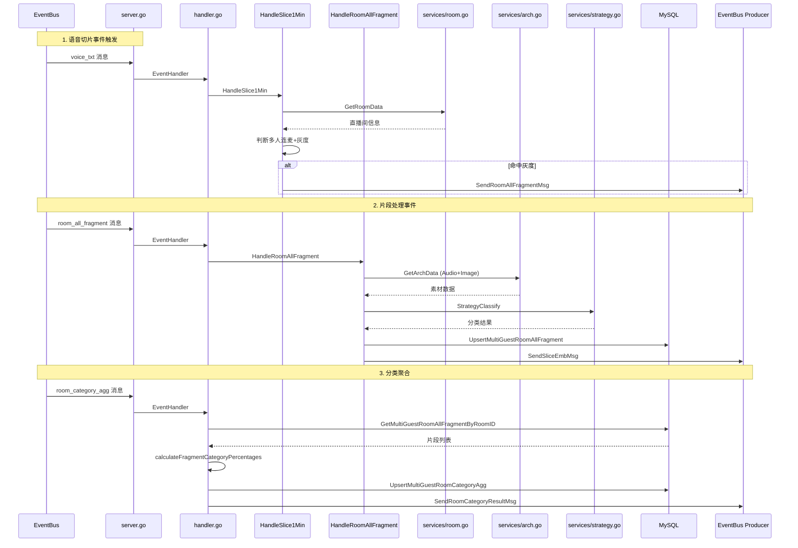
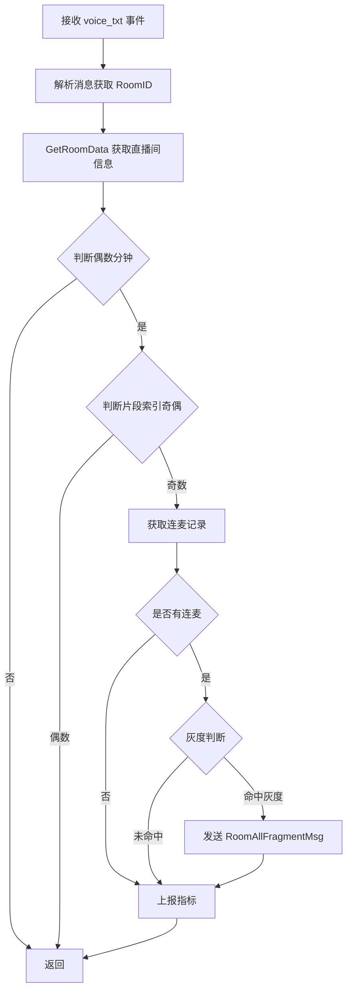
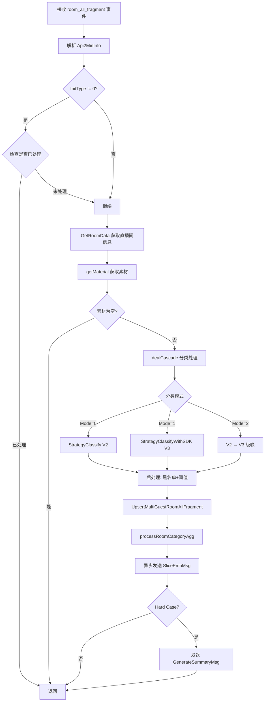
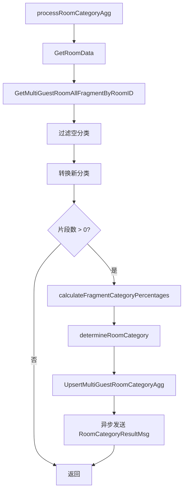
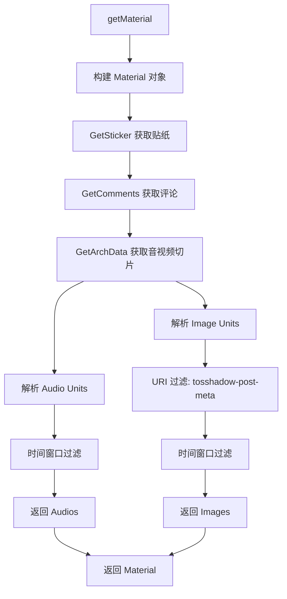

# LinkMic Understand Slice Consumer 项目文档

## 1. 项目目的

本项目是一个**多人连麦直播内容理解消费者服务**，主要负责：

### 核心功能
1. **多人连麦识别**：识别直播间是否为多人连麦场景
2. **直播片段分类**：使用 AI 模型对直播片段进行内容分类
3. **分类聚合统计**：聚合直播间和主播的分类偏好
4. **结果下发**：将分类结果下发给下游服务

### 业务场景
- 为直播间推荐系统提供内容标签
- 识别直播内容类型（辩论、相亲、才艺展示等）
- 为主播画像提供长期内容偏好数据

---

## 2. 项目结构

```
linkmic_understand_slice_consumer/
├── server.go                    # 服务入口，EventBus Consumer
├── handler.go                   # 事件路由分发
├── handler/
│   ├── slice_1min.go           # 1分钟切片处理（多人连麦识别）
│   ├── room_all_fragment.go    # 直播间片段处理（AI分类）
│   ├── room_category_agg.go    # 直播间分类聚合
│   ├── anchor_category_agg.go  # 主播分类聚合
│   └── room_advance_trigger.go # 直播结束触发器处理
├── services/                    # 服务层
│   ├── room.go                 # 直播间数据服务
│   ├── arch.go                 # ARCH 数据服务（音视频切片）
│   ├── arch_embedding.go       # 向量嵌入服务
│   ├── strategy.go             # 分类策略服务 (Laplace V2)
│   ├── strategy_sdk.go         # 分类策略服务 (SDK V3)
│   ├── eventbus.go             # EventBus 生产者
│   ├── mg_room_all_fragment.go # 片段数据存储
│   ├── mg_room_category_agg.go # 直播间聚合存储
│   └── mg_anchor_category_agg.go # 主播聚合存储
├── model/                       # 数据模型
│   ├── material.go             # 素材模型
│   └── eventbus.go             # 消息模型
├── constdef/                    # 常量定义
│   ├── constdef.go             # 分类常量
│   ├── eventbus.go             # EventBus 事件名
│   └── market.go               # 市场配置
├── tcc/                         # TCC 配置中心
│   └── tcc.go                  # 配置获取
├── utils/                       # 工具函数
├── conf/                        # 配置文件
│   └── tikcast_linkmic_understand_slice_consumer.yml
└── script/                      # 部署脚本
```

---

## 3. 代码链路

### 3.1 整体架构图

```
┌─────────────────────────────────────────────────────────────────────────────┐
│                            EventBus (消息队列)                               │
│  ┌─────────────┐ ┌─────────────┐ ┌─────────────┐ ┌─────────────┐           │
│  │voice_txt    │ │room_all_    │ │room_category│ │anchor_      │           │
│  │(1分钟切片)  │ │fragment     │ │_agg         │ │category_agg │           │
│  └──────┬──────┘ └──────┬──────┘ └──────┬──────┘ └──────┬──────┘           │
└─────────┼───────────────┼───────────────┼───────────────┼───────────────────┘
          │               │               │               │
          ▼               ▼               ▼               ▼
┌─────────────────────────────────────────────────────────────────────────────┐
│                              server.go                                       │
│  ┌───────────────────────────────────────────────────────────────────────┐  │
│  │  EventBus Consumer (MultiEvent)                                        │  │
│  │  - 订阅多个 Topic                                                      │  │
│  │  - 路由到对应 Handler                                                   │  │
│  └───────────────────────────────────────────────────────────────────────┘  │
└─────────────────────────────────┬───────────────────────────────────────────┘
                                  │
                                  ▼
┌─────────────────────────────────────────────────────────────────────────────┐
│                              handler.go                                      │
│  ┌───────────────────────────────────────────────────────────────────────┐  │
│  │  EventHandler(ctx, event)                                              │  │
│  │  - switch event.GetHeaders().GetEventName()                           │  │
│  │  - 路由到具体 Handler 方法                                              │  │
│  └───────────────────────────────────────────────────────────────────────┘  │
└─────────────────────────────────┬───────────────────────────────────────────┘
                                  │
          ┌───────────────────────┼───────────────────────┐
          │                       │                       │
          ▼                       ▼                       ▼
┌─────────────────┐   ┌─────────────────┐   ┌─────────────────┐
│ HandleSlice1Min │   │HandleRoomAll    │   │HandleRoomCategory│
│                 │   │Fragment         │   │Agg               │
│ 识别多人连麦     │──▶│ AI分类处理      │──▶│ 聚合统计         │
│ 触发片段处理     │   │ 存储结果        │   │ 下发结果         │
└─────────────────┘   └─────────────────┘   └─────────────────┘
```

### 3.2 调用时序图



---

## 4. 主要方法

### 4.1 服务入口 (server.go)

| 方法 | 说明 |
|------|------|
| `Init()` | 初始化 TCC、TOS、Strategy 等组件 |
| `main()` | 创建 EventBus Consumer 并启动消费 |

### 4.2 事件路由 (handler.go)

| 方法 | 说明 |
|------|------|
| `EventHandler(ctx, event)` | 根据事件名路由到对应 Handler |

### 4.3 处理器 (handler/)

| 方法 | 说明 |
|------|------|
| `HandleSlice1Min(ctx, event)` | 处理 1 分钟语音切片，识别多人连麦 |
| `HandleRoomAllFragment(ctx, event)` | 处理直播片段，执行 AI 分类 |
| `HandleRoomCategoryAgg(ctx, event)` | 聚合直播间分类结果 |
| `HandleAnchorCategoryAgg(ctx, event)` | 聚合主播 30 天分类偏好 |
| `HandleRoomAdvanceTrigger(ctx, event)` | 直播结束时触发分类聚合 |

### 4.4 服务层 (services/)

| 服务 | 方法 | 说明 |
|------|------|------|
| room.go | `GetRoomData(ctx, roomID)` | 获取直播间信息 |
| arch.go | `GetArchData(ctx, roomID, start, end)` | 获取音视频切片数据 |
| arch_embedding.go | `GetTextEmbedding(ctx, data)` | 获取文本向量嵌入 |
| arch_embedding.go | `GetImageEmbedding(ctx, data)` | 获取图片向量嵌入 |
| strategy.go | `StrategyClassify(ctx, material)` | Laplace V2 分类 |
| strategy_sdk.go | `StrategyClassifyWithSDK(ctx, material)` | SDK V3 分类 |
| eventbus.go | `SendRoomAllFragmentMsg(ctx, msg)` | 发送片段处理消息 |
| eventbus.go | `SendRoomCategoryResultMsg(ctx, msg)` | 发送分类结果 |
| mg_room_all_fragment.go | `UpsertMultiGuestRoomAllFragment(ctx, af)` | 存储片段分类 |
| mg_room_category_agg.go | `UpsertMultiGuestRoomCategoryAgg(ctx, rca)` | 存储直播间聚合 |
| mg_anchor_category_agg.go | `UpsertMultiGuestAnchorCategoryAgg(ctx, aca)` | 存储主播聚合 |

---

## 5. 实现方式

### 5.1 事件订阅配置

```yaml
EventConfig:
  - Event: "tiktok.live.llm.voice_txt"           # 1分钟语音切片
    Group: "llm_voice_txt_tikcast.lm_und.sl_cons"
    WorkerNumber: 4
  - Event: "tiktok.webcast.linkmic.llm.room_all_fragment"  # 直播间片段
    Group: "llm_room_all_fragment_tikcast.lm_und.sl_cons_new"
    WorkerNumber: 4
  - Event: "tiktok.webcast.linkmic.llm.room_category_agg"  # 直播间聚合
    Group: "llm_room_category_agg_tikcast.lm_und.sl_cons"
    WorkerNumber: 4
  - Event: "tiktok.webcast.linkmic.llm.anchor_category_agg" # 主播聚合
    Group: "llm_anchor_category_agg_tikcast.lm_und.sl_cons"
    WorkerNumber: 4
  - Event: "webcast_room_advance_trigger"         # 直播结束触发
    Group: "room_advance_trigger_tikcast.lm_und.sl_cons"
    WorkerNumber: 4
```

### 5.2 内容分类体系

```go
const (
    CategoryBoxBattle   = "BoxBattle"    // 盲盒对战
    CategoryDebating    = "Debating"     // 辩论
    CategoryConsulting  = "Consulting"   // 咨询
    CategoryTalentShow  = "TalentShow"   // 才艺展示
    CategoryDating      = "Dating"       // 相亲

    CategoryNoGameplay  = "NoGameplay"   // 无玩法
    CategoryUnCovered   = "UnCovered"    // 未覆盖
)
```

### 5.3 分类策略（级联模式）

```
┌─────────────────────────────────────────────────────────────────┐
│                      分类策略选择                                │
├─────────────────────────────────────────────────────────────────┤
│  Mode = 0: SocialClassifierV2 (Laplace)                         │
│  Mode = 1: SocialClassifierV3 (Triton SDK)                      │
│  Mode = 2: SocialClassifierV2 → SocialClassifierV3 (级联)       │
│           如果 V2 分类在 CascadeCategory 中，则使用 V3 重分类    │
└─────────────────────────────────────────────────────────────────┘
```

### 5.4 分类结果后处理

```go
// 1. 黑名单过滤
if config.IsInBlackList(anchorID) {
    category = config.BackupCategory  // 默认 "NoGameplay"
    score = 0
}

// 2. 阈值过滤
if score <= threshold {
    category = config.BackupCategory
    score = 0
}

// 3. Hard Case 送审
if entropySum > cfg.EntropySumThreshold {
    SendGenerateSummaryMsg()  // 触发人工审核
}
```

### 5.5 聚合算法

```go
// 直播间分类聚合规则
func determineRoomCategory(percentages []*CategoryPercentage) string {
    top1 := percentages[0]
    top2 := percentages[1]

    // 有玩法分类直接返回
    if top1.Category != "NoGameplay" && top1.Category != "UnCovered" {
        return top1.Category
    }
    // 占比 >= 80% 直接返回
    if top1.Percentage >= 80 {
        return top1.Category
    }
    // 第二分类占比 >= 30% 且有玩法，返回第二分类
    if top1.Percentage < 80 && top2.Percentage >= 30 &&
        top2.Category != "NoGameplay" && top2.Category != "UnCovered" {
        return top2.Category
    }
    return top1.Category
}
```

---

## 6. 数据流

### 6.1 消息结构

#### 输入消息

```go
// 1分钟切片消息
type SliceMinInfo struct {
    RoomID    int64  `json:"room_id"`
    WindStart string `json:"wind_start"`  // UTC 时间
    WindEnd   string `json:"wind_end"`
}

// 片段处理消息
type Api2MinInfo struct {
    RoomID        int64 `json:"room_id"`
    StartTime     int64 `json:"start_time"`
    EndTime       int64 `json:"end_time"`
    FragmentIndex int64 `json:"fragment_index"`
    InitType      int64 `json:"init_type"`
}

// 主播聚合消息
type ApiAnchorAggInfo struct {
    AnchorID int64 `json:"anchor_id"`
    AggUnix  int64 `json:"agg_unix"`  // 聚合时间点
}
```

#### 输出消息

```go
// 分类结果下发
type RoomCategoryResultInfo struct {
    AnchorID               int64  `json:"anchor_id"`
    RoomID                 int64  `json:"room_id"`
    StrategyCategoryLevel1 *StrategyCategoryTag `json:"strategy_category_level1"`
    ExpireTime             int64  `json:"expire_time"`  // 15分钟后过期
}

// 向量嵌入消息
type SliceEmbMsg struct {
    RoomID          int64     `json:"room_id"`
    StartTime       int64     `json:"start_time"`
    EndTime         int64     `json:"end_time"`
    TitleStickerEmb []float64 `json:"title_sticker_emb"`
    ASREmb          []float64 `json:"asr_emb"`
    ImageEmb        []float64 `json:"image_emb"`
}
```

### 6.2 数据流转图

```
┌──────────────────────────────────────────────────────────────────────────┐
│                           数据流完整链路                                   │
└──────────────────────────────────────────────────────────────────────────┘

┌─────────────┐     ┌─────────────┐     ┌─────────────┐     ┌─────────────┐
│ 语音切片     │     │ 直播间片段   │     │ 素材获取     │     │ AI 分类     │
│ (voice_txt) │────▶│ 判断多人连麦 │────▶│ Audio+Image │────▶│ Strategy    │
└─────────────┘     └─────────────┘     └─────────────┘     └──────┬──────┘
                                                                   │
                    ┌──────────────────────────────────────────────┘
                    │
                    ▼
┌─────────────┐     ┌─────────────┐     ┌─────────────┐     ┌─────────────┐
│ 向量嵌入     │     │ 片段存储     │     │ 直播间聚合   │     │ 结果下发     │
│ Title+ASR   │────▶│ MySQL       │────▶│ 计算占比     │────▶│ EventBus    │
│ +Image      │     │ fragment表  │     │ 确定分类     │     │ 下游服务    │
└─────────────┘     └─────────────┘     └─────────────┘     └─────────────┘
```

### 6.3 数据库表结构

#### multi_guest_room_all_fragment (片段分类表)

| 字段 | 类型 | 说明 |
|------|------|------|
| id | int64 | 主键 |
| room_id | int64 | 直播间 ID |
| start_time | int64 | 片段开始时间 |
| end_time | int64 | 片段结束时间 |
| anchor_id | int64 | 主播 ID |
| fragment_index | int64 | 片段索引 |
| strategy_category | string | 分类结果 |
| strategy_score | float64 | 分类得分 |

#### multi_guest_room_category_agg (直播间聚合表)

| 字段 | 类型 | 说明 |
|------|------|------|
| id | int64 | 主键 |
| room_id | int64 | 直播间 ID (唯一) |
| start_time | int64 | 直播开始时间 |
| end_time | int64 | 直播结束时间 |
| anchor_id | int64 | 主播 ID |
| strategy_category | string | 聚合分类结果 |

#### multi_guest_anchor_category_agg (主播聚合表)

| 字段 | 类型 | 说明 |
|------|------|------|
| id | int64 | 主键 |
| anchor_id | int64 | 主播 ID |
| agg_day | int64 | 聚合日期 (YYYYMMDD) |
| strategy_category | string | 主播分类偏好 |

---

## 7. 代码逻辑图

### 7.1 HandleSlice1Min 流程



### 7.2 HandleRoomAllFragment 流程



### 7.3 分类聚合流程



### 7.4 素材获取流程



---

## 8. 依赖说明

### 8.1 内部依赖

| 依赖 | 说明 |
|------|------|
| `eventbus/client-go` | EventBus 消息队列客户端 |
| `tikcast/room_sdk` | 直播间数据 SDK |
| `tikcast/rpc_tikcast_rag_server` | ARCH 切片数据服务 |
| `tikcast/llm_global_scheduling/sdk` | AI 分类 SDK |
| `tikcast/tikcast_llm_model_emb_image_trt_rpc` | 图片向量嵌入服务 |
| `gorm/bytedgorm` | MySQL ORM |

### 8.2 外部服务

| 服务 | 用途 |
|------|------|
| MySQL (multi_guest_admin) | 存储分类结果和聚合数据 |
| TOS (对象存储) | 存储音频、图片素材 |
| TCC (配置中心) | 获取策略配置、灰度配置 |
| Laplace (模型服务) | 调用 AI 分类模型 |

---

## 9. 部署说明

### 9.1 构建

```bash
./build.sh
```

### 9.2 配置文件

- 开发环境: `conf/tikcast_linkmic_understand_slice_consumer.yml` 中的 `Develop` 部分
- 生产环境: `Product` 部分

### 9.3 运行

```bash
./output/bootstrap.sh
```

---

## 10. 扩展能力

### 10.1 添加新的分类类型

1. 在 `constdef/constdef.go` 中添加新分类常量
2. 在 `CategoryID` 映射中添加对应 ID
3. 在 `TransNewCategory` 中添加转换规则

### 10.2 添加新的消费事件

1. 在 `constdef/eventbus.go` 中添加事件名常量
2. 在配置文件中添加 EventConfig
3. 在 `handler.go` 的 `EventHandler` 中添加路由
4. 在 `handler/` 目录下实现新的处理方法

---

## 11. 监控指标

| 指标 | 说明 |
|------|------|
| `SliceThroughputMetric` | 切片处理吞吐量 |
| `MaterialThroughputMetric` | 素材获取情况 |
| `StrategyThroughputMetric` | 分类调用情况 |
| `TextEmbeddingThroughputMetric` | 文本嵌入调用情况 |
| `ImageEmbeddingThroughputMetric` | 图片嵌入调用情况 |
| `ClassifyResultEntropySumMetrics` | 分类熵值分布 |

---

## 12. 应用场景

1. **推荐系统**：为直播间推荐提供内容标签
2. **内容运营**：识别热门玩法，优化内容分发
3. **主播画像**：构建主播长期内容偏好画像
4. **内容审核**：Hard Case 自动触发人工审核
