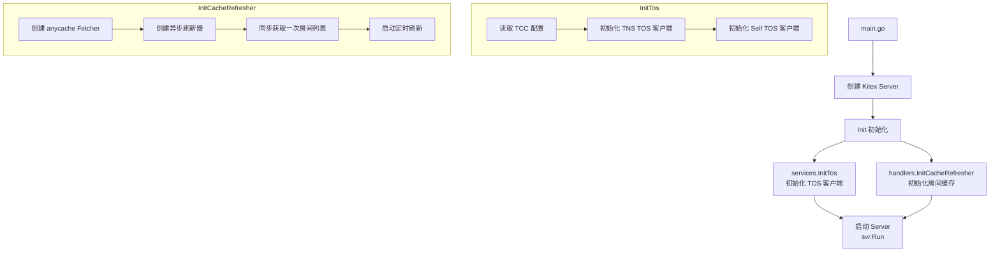
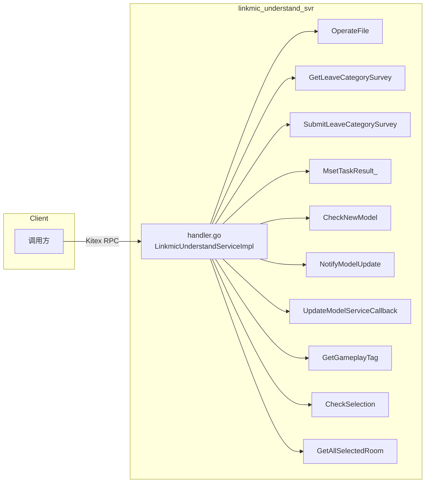
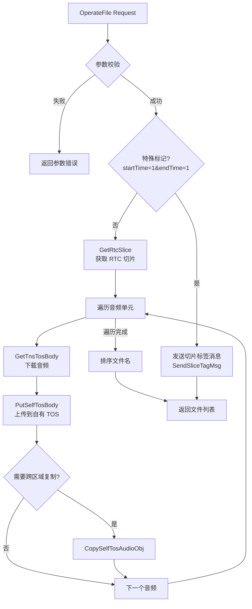
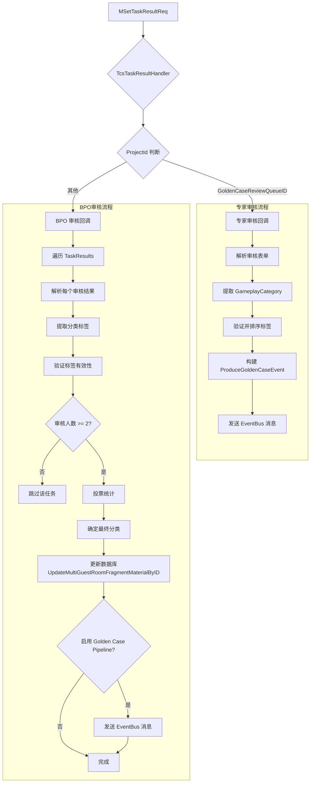
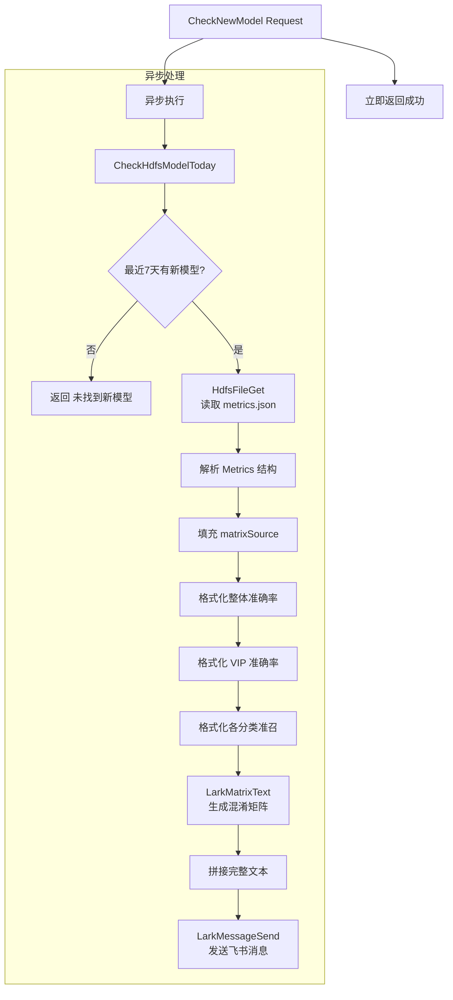
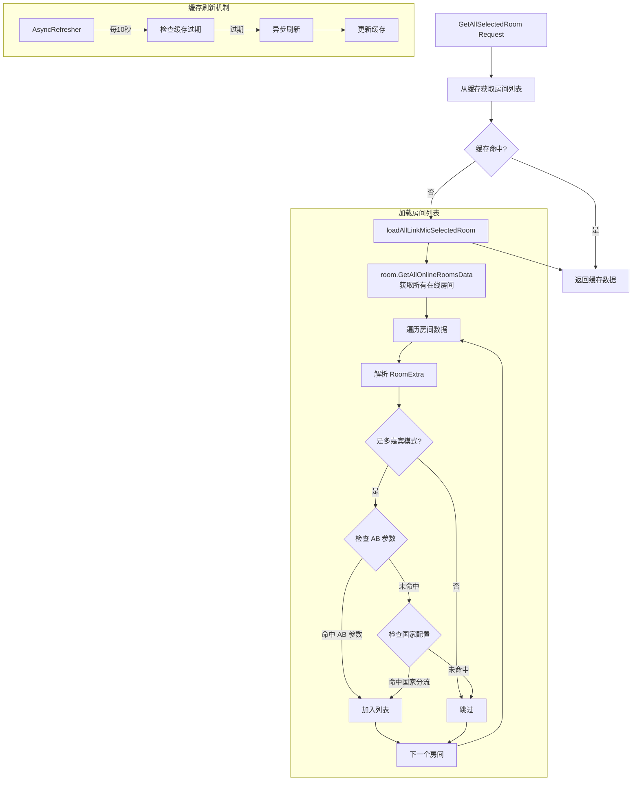
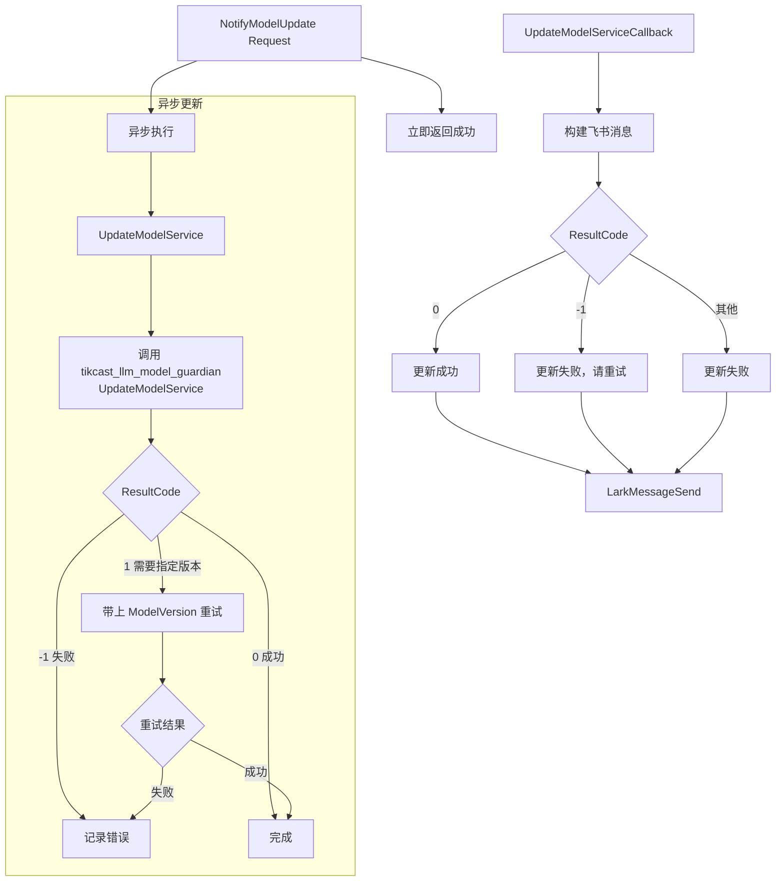
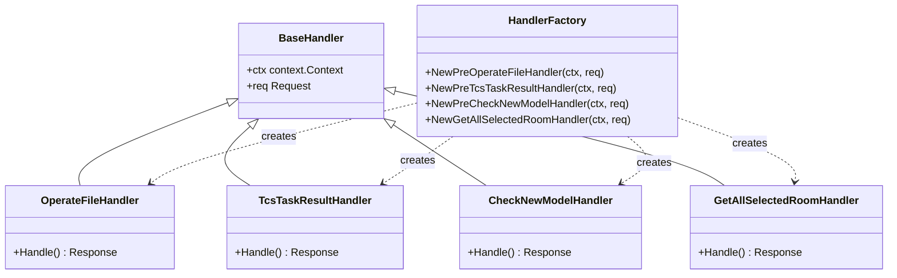
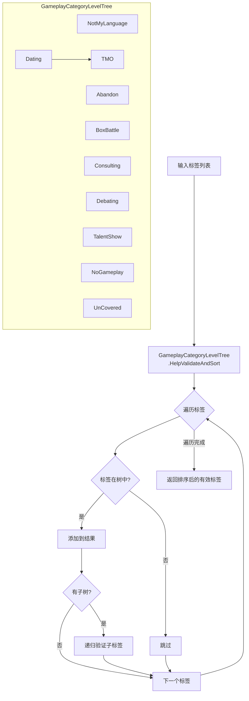

# 代码逻辑图

## 1. 服务启动流程

## 2. RPC 接口路由

## 3. OperateFile 处理流程

## 4. TCS 审核回调处理流程

## 5. CheckNewModel 处理流程

## 6. GetAllSelectedRoom 处理流程

## 7. 模型更新流程

## 8. Handler 通用模式

## 9. 分类标签验证流程

